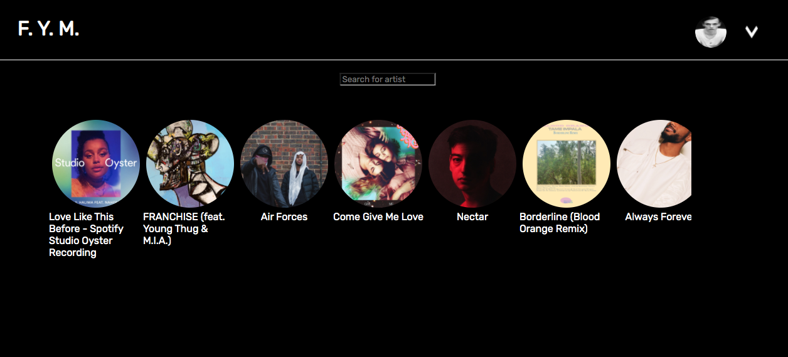

# f.y.m.

### Desciption

This was my final profject at Spiced Academy. F. Y. M. stands for Find Your Music. 

The user get recommendations by new releases from a randomly choosen country from the Spotify API. 

When the image of an artist gets clicked, the Youtube videos from that artist get rendered on the same page.

### Technology

* Node/Express server
* React.js framework with Redux
* Spotify API and Youtube API
* PostgreSQL database
* User files uploaded to AWS
* Testing with Jest and React Testing Library

### Features

* User get recommendations a set of 20 artists, the next 20 artists are loaded by a horizontal infinite scroll

**Navigation**

* Access to components is controlled by cookies
* Once logged in, users navigate to different components via a drop-down menu

**Secruity**

* User information is protected with bcrypt.js and csurf

### Preview

